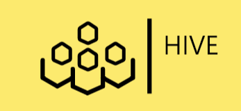

<h1 align="center">
    
</h1>

<div align="center">
  Hive.Et, Use your skills to build your community
  <br />
  <br />
  <a href="https://github.com/gediont/hive/issues/new?assignees=&labels=bug&template=01_BUG_REPORT.md&title=bug%3A+">Report a Bug</a>
  ·
  <a href="https://github.com/gediont/hive/issues/new?assignees=&labels=enhancement&template=02_FEATURE_REQUEST.md&title=feat%3A+">Request a Feature</a>
  .
  <a href="https://github.com/gediont/hive/discussions">Ask a Question</a>
</div>

<div align="center">
<br />

[](LICENSE)

[](https://github.com/gediont/hive/issues?q=is%3Aissue+is%3Aopen+label%3A%22help+wanted%22)
[](https://github.com/GedionT)

</div>

<details open="open">
<summary>Table of Contents</summary>

- [About](#about)
  - [Built With](#built-with)
- [Getting Started](#getting-started)
  - [Prerequisites](#prerequisites)
  - [Usage](#usage)
    - [Frontend Installation](#cookiecutter-template)
    - [Manual setup](#manual-setup)
    - [Variables reference](#variables-reference)
- [Roadmap](#roadmap)
- [Contributing](#contributing)
- [Support](#support)
- [License](#license)
- [Acknowledgements](#acknowledgements)

</details>

---

## About

<table>
<tr>
<td>

Hive.Et is a non-for-profit organization that works to connect volunteers across all walks of life to activities and organizations that are in need of the skills possessed by the individuals in the community. Our Hivers are students, teachers, politicians, company owners, professors, accountants, ... across all walks of lives that make use of their much needed skills to good use by building their community.

We work for fundraising, campaigns, teaching-learning, cleaning, leasing, and much more. The services we provide is not just matching you with what you want and what is nearby and convenient, but also track all your activities to certify and acknowledge your work. We also work **with organization** to serve the custom needs of their organization to meet their **CSR goals**. CSR also known as corporate social responsibility, pertains to people and organizations behaving and conducting business ethically and with sensitivity towards social, cultural, economic, and environmental issues. Striving for social responsibility helps individuals, organizations, and governments have a positive impact on development, business, and society.

Last but not least, we work with schools and education institutions to take charge of volunteers and their activities in a well-controlled manner. Students put to use their in school skills in practice and gain valuable experience by building on what they have learned in class rooms.

Key features of **Hive.Et**:

- Get matched to an organization that needs your skill
- As a volunteer, you can track your progress and achievements
- Print and share your progress with your friends
- Organization can track and track-back your progress
- Checkout organizations near you on a map
- Start a campaign as a registered NGO or a registered company
- Raise funds for different causes
- Unsupervised machine learning to find insight about volunteers, skills-set, demographics...
- Stream live attendees via apache kafka onto geo-maps

<details open>
<summary>Additional info</summary>
<br>

This project is built based on Microsoft's Guide of Design System based on Material UI
Our component libraries are from Fluent UI - based on Microsoft's Design System

This project is the result of huge research. I'm a long-time GitHub user so I've seen more than [7.3k](https://github.com/GedionT?tab=stars) READMEs so far. I've started writing docs for my open source projects (that are currently in their early stages so they exist in the private space for now). After I've **analyzed many popular GitHub** READMEs and other GitHub-related docs and features I've tried to create a general-propose template that may be useful for any project.

</details>

</td>
</tr>
</table>

### Built With

- [React]()
- [Nodejs]()
- [Jest]()
- [FluentUI]()
- [GitHub]()
- [GitHub Actions]()
- [Netlify]()
- [Postman]()
- [Docker]()
- [Google Analytics]()
- [Google Maps]()
- [MongoDB]()
- [kSql]()
- [Python]()
- [Tensorflow]()
- [Tensorflow-Serve]()
- [Apache Kafka]()

## Getting Started

### Prerequisites

The recommended method to get started contributing to **Hive.Et** is by using cloning the latest commit/ version from [Hive](https://github.com/gediont/hive). You can also download the repository and then install the dependencies by extracting the directory

The easiest way to start contributing to **Hive.et** after cloning is

```sh
git clone https://github.com/gediont/hive.git

cd hive

npm install hive
```

### Usage

#### hive frontend

After installing hive, all you need to do is to run the following command:

```sh
npm start
```

#### Features and Diagrams

1. Steps one
2. Step two
3. Step three
4. Step four

or

`another set of steps to follow or add descriptions accordingly here`

#### Version reference

> Same table description
> | Name | Default value | Description |
> | -------------------------- | ------------------ | --------------------------------------------------------------------------- |
> | PROJECT_NAME | My Amazing Project | Your project name |
> | REPO_SLUG | my-amazing-project | Repo slug must match the GitHub repo URL slug part |
> | GITHUB_USERNAME | GedionT | Your GitHub username **without @** |
> | FULL_NAME | Alexey Potapov | Your full name |
> | OPEN_SOURCE_LICENSE | MIT license | Full OSS license name |
> | modern_header | y | Use HTML to prettify your header |
> | table_in_about | n | Use table to wrap around About section |
> | include_logo | y | Include Logo section. Only valid when `modern_header == y` |

## Roadmap

See the [open issues](https://github.com/gediont/hive/issues) for a list of proposed features (and known issues).

- [Top Feature Requests](https://github.com/gediont/hive/issues?q=label%3Aenhancement+is%3Aopen+sort%3Areactions-%2B1-desc) (Add your votes using the 👍 reaction)
- [Top Bugs](https://github.com/gediont/hive/issues?q=is%3Aissue+is%3Aopen+label%3Abug+sort%3Areactions-%2B1-desc) (Add your votes using the 👍 reaction)
- [Newest Bugs](https://github.com/gediont/hive/issues?q=is%3Aopen+is%3Aissue+label%3Abug)

## Contributing

First off, thanks for taking the time to contribute! Contributions are what makes the open-source community such an amazing place to learn, inspire, and create. Any contributions you make will benefit everybody else and are **greatly appreciated**.

Please try to create bug reports that are:

- _Reproducible._ Include steps to reproduce the problem.
- _Specific._ Include as much detail as possible: which version, what environment, etc.
- _Unique._ Do not duplicate existing opened issues.
- _Scoped to a Single Bug._ One bug per report.

Please adhere to this project's [code of conduct](docs/CODE_OF_CONDUCT.md).

## Support

Reach out to the maintainer at one of the following places:

- [GitHub discussions](https://github.com/gediont/hive/discussions)
- The email which is located [in GitHub profile](https://github.com/GedionT)

## License

This project is licensed under the **MIT license**. Feel free to edit and distribute this template as you like.

See [LICENSE](LICENSE) for more information.

## Acknowledgements

Thanks for these awesome resources that were used during the development of the **Hive.Et**:

- <https://github.com/>
